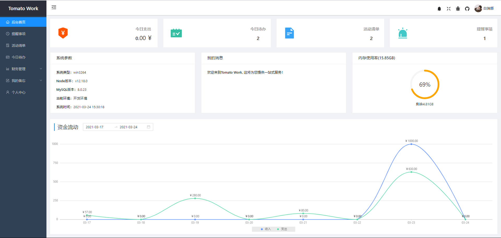

<p align="center">
  
  <p align="center">Tomato Work 个人事务管理系统(客户端)</b>
  <p align="center">
    <a href="https://github.com/Bairuina/graduation-project"> 
      客户端
    </a>
      <a href="https://github.com/Bairuina/graduation-project-sever">
      服务端
    </a>
  </p>
</p>


## 项目截图



## 技术栈
- [Hooks](https://zh-hans.reactjs.org/docs/hooks-intro.html)
- [TypeScript](https://www.typescriptlang.org/)
- [Redux](https://redux.js.org/tutorials/fundamentals/part-5-ui-react)
- [Ant Design](https://ant.design/docs/react/introduce-cn)


## 项目启动
- Node.js >= 14
- 确保已安装 [yarn](https://yarnpkg.com/)

``` bash
# 克隆项目
git clone https://github.com/Bairuina/graduation-project.git

# 安装依赖
yarn

# 启动项目（账号：bairuina 密码：123456）
yarn start

# 项目打包
yarn build
```
